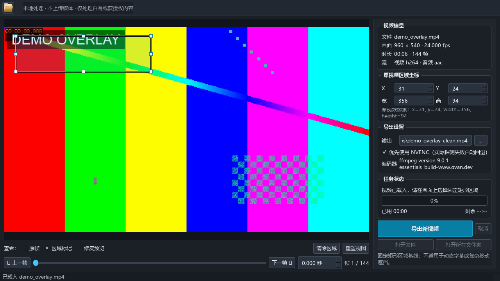
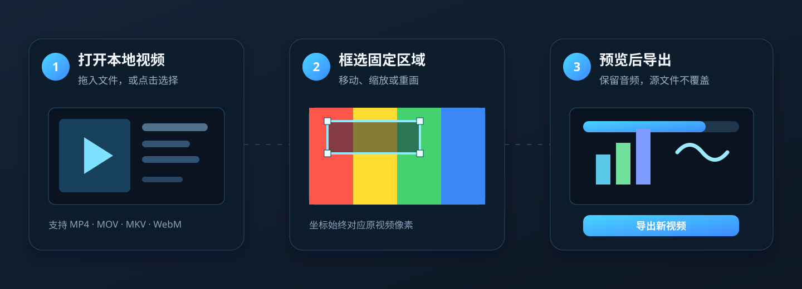

# Video Region Cleaner

简体中文 ｜ [English](README_EN.md)

[](https://github.com/instann/video-region-cleaner/releases/latest)
[](#你的视频始终留在电脑里)
[](LICENSE)

> **框选视频中一个固定区域，先看修复预览，再导出带音频的新视频。**
>
> 用于自有或获授权内容中的固定标签、时间码、相机叠加层和内部审阅标记；不上传视频，不覆盖源文件。





## 下载后，3 步开始

### 1. 下载并完整解压

[下载最新 Windows x64 版](https://github.com/instann/video-region-cleaner/releases/latest) → 选择 `VideoRegionCleaner-*-windows-x64-pyinstaller.zip`。

解压整个 ZIP；**不要把 `VideoRegionCleaner.exe` 单独移出文件夹**，它需要同目录内的运行组件。

> 当前 Windows 发行包未进行代码签名，SmartScreen 可能出现提示。请只从本仓库 Releases 下载，并使用同一 Release 的 `SHA256SUMS.txt` 校验文件。

### 2. 双击运行

打开解压目录中的 `VideoRegionCleaner.exe`。无需安装 Python，也无需安装 FFmpeg。

### 3. 拖入视频，框选并导出

把 MP4、MOV、MKV 或 WebM 拖入窗口。定位一个代表帧，拖出矩形并确认“修复预览”，然后点击“导出新视频”。

输出文件默认命名为 `<源文件名>_clean.mp4`；如果同名文件已存在，会自动编号，绝不覆盖已有文件。

## 它解决什么问题？

当视频中的某个视觉元素始终停留在同一位置时，逐帧手工处理既慢又难复核。Video Region Cleaner 把这个流程变成一次明确的操作：

- 在任意帧定位区域，再移动、缩放、清除或重画矩形。
- 对比原帧、区域标记和单帧修复预览后再导出。
- 流式处理整段视频，保留音频，显示进度、耗时、预计剩余时间，并可取消。


## 你的视频始终留在电脑里

- **不上传媒体，不发送遥测。**
- **源文件不会被修改。** 输出始终是新文件。
- **坐标准确。** 选区使用原视频像素坐标，适配黑边、缩放、高 DPI、横屏与竖屏。
- **可靠导出。** Windows 会实际探测 NVENC；不可用时自动回退 `libx264`。源音频无法直接封装时，会回退为 AAC。

## 适合什么，不适合什么？

适合位置固定、面积较小、背景相对简单的视觉区域。

当前版本只处理**一个固定矩形**。它不跟踪移动目标，不处理动态字幕，也不承诺在大面积遮挡、复杂运动或高频纹理中还原原始像素。

## macOS

源码支持 Apple Silicon 和 Intel Mac 的构建，并会优先探测 VideoToolbox 编码；目前 Latest Release 尚未提供已签名、公证的 macOS 应用包。需要在 Mac 上使用时，请按下方“维护与源码”中的说明从源码构建。

<details>
<summary><strong>维护与源码：运行、测试、构建、哈希</strong></summary>

### Windows 从源码运行

```powershell
git clone https://github.com/instann/video-region-cleaner.git
cd video-region-cleaner
python -m venv .venv
.\.venv\Scripts\python.exe -m pip install -r requirements-dev.txt
.\.venv\Scripts\python.exe -m pip install -e . --no-deps
powershell -ExecutionPolicy Bypass -File scripts\prepare_ffmpeg.ps1
.\.venv\Scripts\python.exe run_gui.pyw
```

### macOS 从源码构建

需要 macOS 13+、Python 3.11+ 和 Xcode Command Line Tools。Apple Silicon 与 Intel 需要分别在对应架构的 Mac 上构建。

```bash
git clone https://github.com/instann/video-region-cleaner.git
cd video-region-cleaner
python3 -m venv .venv
.venv/bin/python -m pip install -r requirements-dev.txt
.venv/bin/python -m pip install -e . --no-deps
scripts/build_macos.sh
```

### 测试和 Windows 发行构建

```powershell
.\.venv\Scripts\python.exe -m pytest -q
.\.venv\Scripts\python.exe scripts\run_e2e.py
powershell -ExecutionPolicy Bypass -File scripts\build_pyinstaller.ps1
powershell -ExecutionPolicy Bypass -File scripts\build_nuitka.ps1
powershell -ExecutionPolicy Bypass -File scripts\write_checksums.ps1
```

发行校验与测试记录见 [docs/VERIFICATION_REPORT.md](docs/VERIFICATION_REPORT.md)，公有发布检查见 [docs/PUBLIC_RELEASE_CHECKLIST.md](docs/PUBLIC_RELEASE_CHECKLIST.md)。Windows 发行文件的 SHA-256 位于同一 Release 的 `SHA256SUMS.txt`。

兼容 CLI 入口：

```powershell
.\.venv\Scripts\python.exe region_cleaner.py examples\demo_overlay.mp4 `
  --region 15,15,330,80 --output examples\demo_overlay_clean.mp4
```

</details>

## 贡献者与致谢

请参见 [CONTRIBUTORS.md](CONTRIBUTORS.md)。项目维护者是 [@instann](https://github.com/instann)，[@modengsir](https://github.com/modengsir) 贡献了 macOS 支持；[OpenAI Codex](https://openai.com/codex/) 以 AI 编程协作工具的身份参与实现、测试和文档工作。

## 合法使用与许可

仅处理你自有或获授权编辑的内容。你须自行遵守适用法律、合同、许可证、平台条款、披露及署名义务。本项目不提供法律意见，也不受任何平台或商标所有者认可、赞助或关联。

仓库中的演示视频、截图和插图均为项目自制的合成或原创素材，不含第三方平台标识或私人内容。

项目采用 [MIT License](LICENSE)，上游署名见 [NOTICE.md](NOTICE.md)。FFmpeg 作为独立进程随发行包按其构建所附 GPLv3 条款分发，详见 [THIRD_PARTY_NOTICES.md](THIRD_PARTY_NOTICES.md)。
